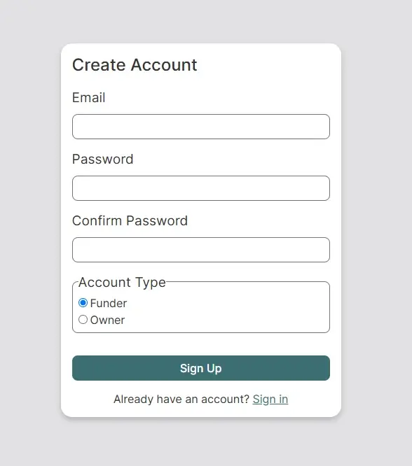
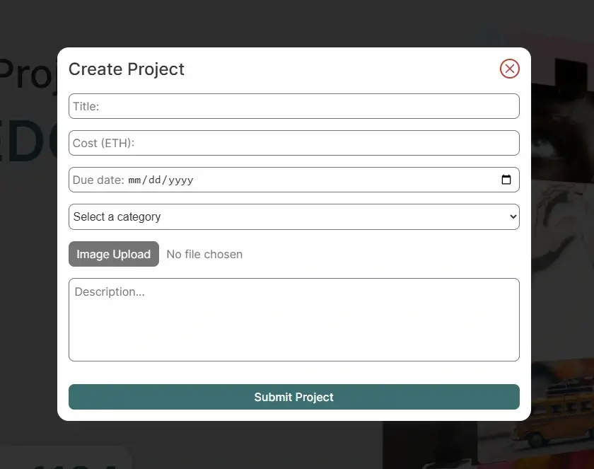
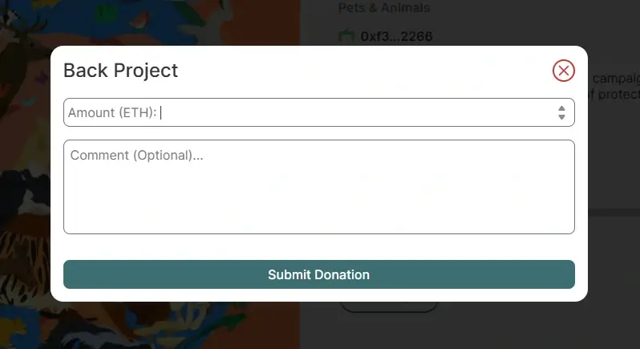
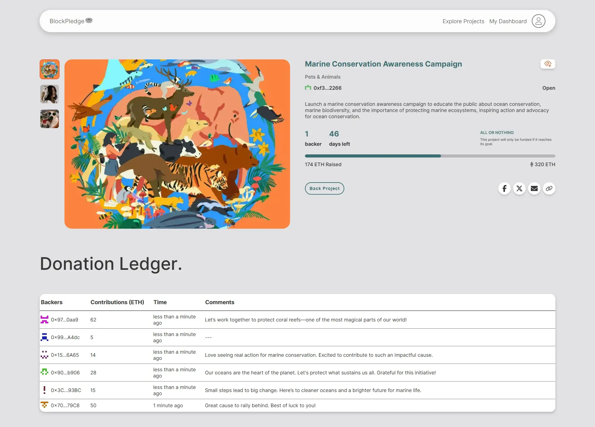

# BlockPledge: Decentralized Crowdfunding Platform

**BlockPledge** is a decentralized crowdfunding platform powered by Ethereum, revolutionizing fundraising with security, transparency, and efficiency at its core. Built on blockchain technology, it facilitates trustless transactions, automated payouts, and seamless user authentication. Whether you're a **project owner** launching a campaign or a **funder** supporting a cause, BlockPledge ensures every step is reliable and straightforward.

This repository houses the full-stack application—featuring a Next.js frontend, Firebase backend, and Solidity smart contracts. It’s currently configured for local development and testing with Hardhat and MetaMask.

---

## 🌟 Features

- **Dual User Roles**: Sign up as a project owner to create campaigns or as a funder to donate, with Firebase managing authentication.
- **Campaign Management**: Project owners can craft, update, or remove campaigns.
- **Smart Contract Automation**: Donations in Ether (via MetaMask) trigger automated payouts or refunds through Solidity contracts.
- **Admin Oversight**: An admin dashboard allows project authorization, ensuring quality control.
- **Dynamic Browsing**: Filter projects by category or search terms in real time.
- **Notifications**: EmailJS sends payout updates to project owners automatically.

---

## 🛠️ Technologies

- **Frontend**: Next.js, React, TypeScript, Sass, Framer Motion
- **Backend**: Firebase (authentication, database)
- **Blockchain**: Ethereum, Solidity, Hardhat, Ethers.js
- **Tools**: MetaMask

---

## 🚀 Getting Started

Since BlockPledge isn’t deployed to a test blockchain, you’ll need to run it locally. Follow these steps to set up and explore the platform:

### Prerequisites

- **Node.js** (v18 or later)
- **MetaMask** browser extension
- **Hardhat** (install globally with `npm install -g hardhat` or use locally)

### Setup Instructions

1. **Clone the Repository**

   ```bash
   git clone https://github.com/jtakaendisa/blockpledge-decentralized-crowdfunding.git
   cd blockpledge-decentralized-crowdfunding
   ```

2. **Install Dependencies**

   ```bash
   npm install
   ```

3. **Configure Environment Variables**

   - Create a `.env.local` file in the root directory.
   - Copy the variables from .env.example and fill in your Firebase, EmailJS, and Pinata credentials.

4. **Launch a Local Blockchain**

   - Open a terminal and run:
     ```bash
     npx hardhat node
     ```
   - This starts a local blockchain server for testing. Keep this terminal running.

5. **Deploy Smart Contracts**

   - In a new terminal, deploy the contracts to your local network:
     ```bash
     npx hardhat run scripts/deploy.ts --network localhost
     ```
   - Note the contract address output in the console for reference.

6. **Set Up MetaMask**

   - Open MetaMask and connect to the **Localhost 8545** network.
   - Import an account using one of the private keys from the Hardhat node (check the terminal running `npx hardhat node` for account details).

7. **Start the Frontend**
   - Launch the Next.js app:
     ```bash
     npm run dev
     ```
   - Visit [http://localhost:3000](http://localhost:3000) in your browser.

---

## 📖 Usage

- **Sign Up**: Register as a project owner or funder.
- **Launch a Campaign**: Project owners can use the "Create Project" feature to start fundraising.
- **Support a Project**: Funders can donate Ether via the "Back Project" option.
- **Admin Tasks**: Access the admin dashboard to approve or reject campaigns (requires admin credentials).

---

## 📸 Screenshots

### Sign Up Form

  
The entry point to BlockPledge, where users register as project owners or funders. Powered by Firebase authentication and styled with Sass, it ensures a seamless onboarding experience with secure form validation using Zod.

### Create Project Modal

  
Enables project owners to launch campaigns with validated inputs (Title, Cost, Due Date) using `react-hook-form` and Zod. Images are optimized with Pinata’s IPFS storage.

### Back Project Modal

  
Allows funders to donate Ether via MetaMask, integrated with Ethers.js for secure blockchain transactions. Smart contracts automate payouts, and EmailJS sends notifications.

### Project Details Page

  
Displays campaign details like title, status, and donation ledger, pulling real-time data from Firebase and Ethereum. Conditional actions based on user roles ensure a dynamic, transparent experience.
